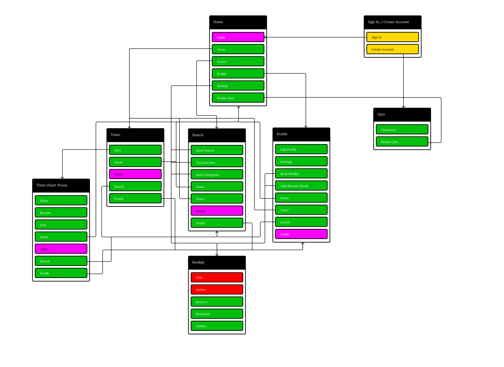

LooseLeaf
-----
### A Capstone/Senior Design Project
We are a team of college students dedicated to creating a web application, LooseLeaf, designed to make reading discovery more approachable for both experienced and new readers. The platform helps users discover books based on their interests, reading preferences, moods, and familiar movies or TV shows.

Our goal is to create a welcoming reading platform where users can discover books, track their reading, organize personal bookshelves, and share reviews and reactions.

Features
----
**Personalized Reading Quiz:** Helps users discover books based on their reading preferences, interests, mood, and familiar movies or TV shows.
* **Book Discovery:** Personalized recommendations, search, categories, and browsing tools.
* **Reviews & Reactions:** Users can rate books, write reviews, post reactions, and choose between Casual and Analytical reviews.
* **Personal Bookshelves:** Organize books into Currently Reading, Finished, Did Not Finish, Favorites, and custom shelves.
* **Reading Timer:** Track reading sessions and reading progress.
* **User Profiles:** Manage reading activity, favorites, shelves, and account settings.
* **Modern UI/UX:** A simple and approachable interface designed for both experienced and new readers.

Digital Information Architecture (DIA):
----

  

Technologies Used:
----
LooseLeaf is currently beginning development. Our planned technology stack is:

### Frontend
* React
* Vite
* JavaScript
* HTML/CSS

### Backend & Database
* Supabase (Authentication & PostgreSQL Database)

### APIs
* Open Library API

### Development & Design Tools
* GitHub
* GitHub Projects
* Figma
* Visual Studio Code

Authors
----
Serena Banuelos - Project Manager 

Michaela Perez - Frontend Developer & UI Implementation 

Joshua Trinh - Full Stack Developer 

Austin Menh - Backend & Database Developer 

Angela Martin - Frontend & Authentication Developer 

